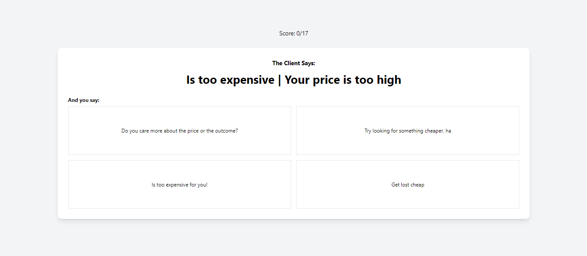

## Sales Objections!

Learn how to handle customer objections with this cool game!

## Game Explanation

Sales Objections works as a quiz where you are given an objection, and you must return the correct answer for that specific objection

This game is basically a fun way to learn how to deal with client objections, so you can become a better salesperson :)

## Technical Requirements for interview prep

- You will be given a file that contains an array with the objections and possible answers, possible answers contain incorrect and correct answers indicated in the same object.
- You will be given the component HTML and CSS built already
- You need to make use of Context
- Questions are randomized
- High score should be saved in Local Storage

## Extra features:

- Score is money, make it so instead of earing points, you earn money!
- After an answer is correct or incorrect, it must show why is correct
- If you answer all questions correctly, confetti should appear with the high score
- Timer, if you don't answer in X given seconds, you automatically lose the sale and you go to the next question
- Difficulty Selector: Easy and Hard.
- HARD MODE: If you answer 1 question wrong, the game ends
- Refactor all game logic withing a provider with a reducer

## Interface Example:

