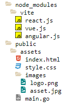

## Solution

In order to solve this problem, you must be familiar with the following topics:

- Conditional Rendering
- Recursion (Components)
- Switch Components
- Uitl Functions

To solve this problem, you must first think of the structure of a File Tree.

Each File could be either a File, or a Folder, which at the end, is an array of files.

If a file is of type folder, then it means that it contains children.
If a file doesn't contain any children, then it means is of type file.

Knowing this information, we could setup a type on Typescript

```ts
type TFile = {
  name: string;
  children?: TFile[];
};
```

Now, when defining the react component, we must think that we could render something like this:

```jsx
<Folder>
  <Folder>
    <File />
    <File />
    <File />
  </Folder>
</Folder>
```

But that would require manually putting those components there, and honestly is not so great...

There is a better way to do it, if we define a recursive component:

```jsx
function File({ name, children }: FileType) {
  const extension = getExtension(name);
  const [isOpen, setIsOpen] = useState(false);
  return (
    <div className="file">
      <span onClick={() => setIsOpen(!isOpen)}>
        {children ? (
          children.length > 0 ? (
            isOpen ? (
              <FaFolderOpen style={{ color: "#DED0B4" }} />
            ) : (
              <FaFolder style={{ color: "#DED0B4" }} />
            )
          ) : (
            ""
          )
        ) : (
          <Icon extension={extension} />
        )}{" "}
        {name}
      </span>
      {isOpen
        ? children?.map((fileProps: FileType) => <File {...fileProps} />)
        : ""}
    </div>
  );
}
```

Notice that we check if the file `isOpen`, and if it is, then we will render the children inside it. Maybe we could ask if the children exist instead of checking if its open, but I think that's not necessary, because we will return nothing either way if its a file.

The great thing is that we can call the File component again with the children properties, which would make it recursive!

# Things I could have done better:

- Use Spread instead of destructuring props (maybe a style preference, not necessarily wrong)
- Recursion always is the same function, but what it changes is a condition on when to stop rendering
- Think about the interface, is an array of objects, not array of strings. If you have used an array of strings, how were you able to dig into each object and checking the children? An object was necessary for things that could have more than 1 value.

# Things I did great

- Instead of using a depth parameter, just use the div as a parent element and then the margin will be relative to the parent element!
- Icons and the getExtension() utils file really great use of that
- Creating files for specific things, great!!
- Great that you noticed that if you put the state to the div, that would affect the entire tree and not the specific folder, kudos to putting it in the correct spot



Inspiration: 
